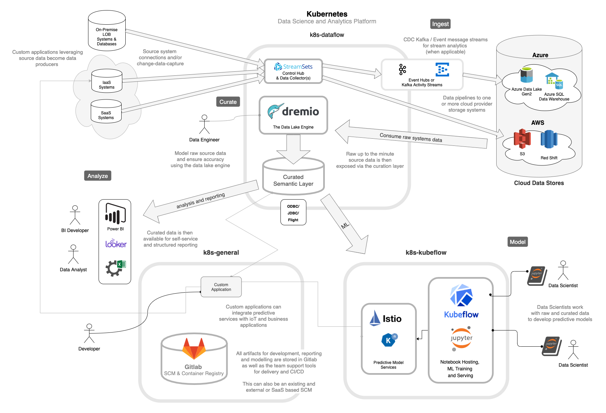

# Dataflow

A _Kubernetes_ based data science and business intelligence platform.  



> The diagram doesn't really do justice to the capabilities within the _Kubeflow_ platform, as it also includes an integrated _Knative_ serverless platform and _Tensoflow_ training.

Leveraging the open source [cluster-builder](https://cluster-builder.idstudios.io) VMware based _Kubernetes_ environment, __Dataflow__ layers on a unifed _platform of platforms_:

## Core

[StreamSets](https://streamsets.com) provides a full DataOps toolset for both ELT and streaming use cases.

[Dremio](https://dremio.com) _The Data Lake Engine_ offers a unifed curation layer with distributed query engine and in-memory query optimization using columnar database technology while leveraging _cloud provider storage_.  Dremio is the core curated _data source_ for the entire _Dataflow_ system, available directly to most modern Bi tools, but also as _ODBC_, _JDBC_ and _Apache Flight_.

[Kubeflow](https://kubeflow.org) provides a large and integrated Machine Learning and Jupyter analysis platform in its own right.  Integrated __Istio__ service mesh provides a direct notebook-to-containerized-predictive-service work flow.

> _Kubeflow_ is such a large platform in itself that it arguably warrants a dedicated Kubernetes cluster, and this may prove to be the recommended deployment model.

## Optional

[Kafka](https://kafka.apache.org/) as an optional intermediary stream engine to fascilitate event driven stateful streaming workflows and audit trails.  With additional components from the [Confluent OSS Platform](https://www.confluent.io/download)

[Gitlab](https://gitlab.org) offering integrated, in-cluster team development and SCM Ci/CD tooling for storing all pre and post deployment artifacts.  Also provides the in-cluster private container registry.

[KEDA](https://github.com/kedacore/keda) providing an _Event Driven Serverless_ programming model for reacting to and enriching the data via customized stream processing and micro-services.

# Kubeflow

Kubeflow installation is so involved and the management so complex, they built a special binary to do it, called `kfctl`.   

Kubeflow is a compilation of a lot of fast moving projects, and tends to be fairly volatile from version to version.  However as it is approaching _1.0_ there is cause for optimism that things may stabilize.

There is a script called [install-kfctl.sh](../xtras/k8s/kubeflow/install-kfctl.sh) available in [../xtras/k8s/kubeflow] that will install the tool in __BASH__. Simply execute it with the correct OS parameter for your workstation:

```
bash install-kfctl.sh darwin
```

> If you are installing this on __Windows__ it is assumed it is within the __WSL__, in which case the parameter to the script will still be __linux__, ironically.


> __Note__ that at the present time the version of `kfctl` returned as __latest__ is not aligned with the documentation.  If `kfctl version` does not return `kfctl v1.0-rc.3-1-g24b60e8` or greater, you may need to download it and install it manually.


Once `kfctl` is installed, a second script from the [Kubeflow documentation]() called [create-project.sh](../xtras/k8s/kubeflow/create-project.sh) can be used to initiate a __Kubeflow__ instance within a cluster:

```
bash create-project.sh kf-main
```

This will create a set of configuration files in a folder called __kf-main__, the use of which has yet to be determined.  They are generally kept within the _cluster-builder_ cluster definition folders.

When the installation completes, and it does take awhile, the command should end successfully with output similar to the following:

```
INFO[0138] Successfully applied application seldon-core-operator  filename="kustomize/kustomize.go:209"
INFO[0139] Applied the configuration Successfully!       filename="cmd/apply.go:72"
```

# Dremio

> Ensure you have __Helm 3__ installed.

__Note__ that due to a gap in the current Helm chart the `values.yaml` _storageClass_ value is not picked up by the zookeeper installation, and will hang Pending PVC allocation.  To work around this there are a few options:

* Use the IDStudios fork at https://github.com/ids/dremio-cloud-tools
* Use the `targetd-default-sc` script in `cluster-builder/xtras/k8s` to make an associated __targetd__ server the default storage class for the cluster.
* Set another storage class as default.

## Dremio Helm Installation Steps

1. Clone the [dremio-cloud-tools](https://github.com/dremio/dremio-cloud-tools) repo.
2. Make a copy of the `charts/dremio/values.yaml` file and store it in your cluster folder as `dremio-values.yaml`.  Adjust the file to support the capacity of your cluster.

> As the _Dremio_ values.yaml contains potentially confidential and _secret_ information, it is best stored with the other cluster configuration files.

3. Ensure your `kubectl` config is set to the target cluster
4. Create the target `dremio` namepace (the namespace name is used below in the helm command): `kubectl create ns dremio`
5. Open a command prompt: `cd dremio-cloud-tools/charts`
6. Execute the __Dremio__ Helm 3 installation:

```
helm install -f <path to cluster folder>/dremio-values.yaml -n dremio dremio dremio
```

> This command uses the dremio-values.yaml to create a dremio release in the dremio namespace, the final `dremio` in the command refers to the local __dremio__ charts folder.

When the _Helm_ install completes _Dremio_ should be alive and functioning.  

```
kubectl get pods -n dremio
```

Check the service allocation:

```
kubectl get svc -n dremio
```

This should return output similar to the following:

```
NAME                 TYPE           CLUSTER-IP       EXTERNAL-IP     PORT(S)                          AGE
dremio-client        LoadBalancer   10.97.1.49       192.168.1.181   31010:30157/TCP,9047:31082/TCP   6m35s
dremio-cluster-pod   ClusterIP      None             <none>          9999/TCP                         6m35s
zk-cs                ClusterIP      10.110.116.193   <none>          2181/TCP                         6m35s
zk-hs                ClusterIP      None             <none>          2181/TCP,2888/TCP,3888/TCP       6m35s
```

> Assuming the cluster is using __MetalLB__, it will allocate a dedicated IP address to the _Dremio Web Client_, which is available on port: __9047__.


In the above example, browse to http://192.168.1.181:9047 for the Dremio Web UI.

# StreamSets

StreamSets is a [platform](https://streamsets.com) based on open source, and their supported [data collector](https://hub.docker.com/layers/streamsets/datacollector/) docker container is free to use.  

In the [xtras/k8s/streamsets](../xtras/k8s/streamsets/streamsets.yml) folder there is a `streamsets.yml` designed to use `targetd`.

Installation is straightforward:

```
kubectl create ns <anything>
kubectl apply -f xtras/k8s/streamsets/streamsets.yml -n <anything>
```

In a few minutes the service will be deployed:

```
kubectl get all -n streamsets
NAME                                 READY   STATUS    RESTARTS   AGE
pod/streamsets-dc-5647db8dc4-2mnhj   1/1     Running   0          2m9s

NAME                            TYPE           CLUSTER-IP     EXTERNAL-IP     PORT(S)           AGE
service/streamsets-dc-service   LoadBalancer   10.106.83.83   192.168.1.182   18630:31729/TCP   2m9s

NAME                            READY   UP-TO-DATE   AVAILABLE   AGE
deployment.apps/streamsets-dc   1/1     1            1           2m9s

NAME                                       DESIRED   CURRENT   READY   AGE
replicaset.apps/streamsets-dc-5647db8dc4   1         1         1       2m9s
```

The _StreamSets Web UI_ should then be available at https://EXTERNAL-IP:18630, which enables both pipeline design and management.

> Something like Microsoft SQL Server, with an example available in [../xtras/k8s/mssql/mssql.yml](../xtras/k8s/mssql/mssql.yml) can serve as a good _RDBMS_ to play with with respect to _CDC_ and data pipelines.